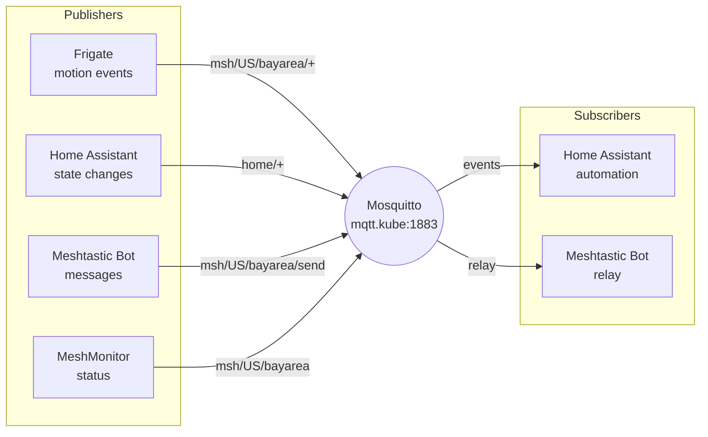

# Home Cluster Topology

Document generated automatically. Machine-readable data available in YAML blocks.

## Quick Reference

### Core Ingress Endpoints

| Endpoint | Namespace | Service | Port | Auth |
|----------|-----------|---------|------|------|
| [traefik.kube.stevearnett.com](https://traefik.kube.stevearnett.com) | traefik | api@internal | 8443 | none |
| [registry.kube.stevearnett.com](https://registry.kube.stevearnett.com) | registry | registry | 5000 | none |
| [pihole.kube.stevearnett.com](https://pihole.kube.stevearnett.com) | pihole | pihole-web | 80 | none |
| [ha.kube.stevearnett.com](https://ha.kube.stevearnett.com) | home-assistant | home-assistant | 8123 | none |
| [frigate.kube.stevearnett.com](https://frigate.kube.stevearnett.com) | frigate | frigate | 5000 | none |
| [plex.kube.stevearnett.com](https://plex.kube.stevearnett.com) | plex | plex-plex-media-server | 32400 | none |
| [media.kube.stevearnett.com](https://media.kube.stevearnett.com) | media | jellyfin | 8096 | none |
| [prowlarr.kube.stevearnett.com](https://prowlarr.kube.stevearnett.com) | media | prowlarr | 9696 | none |
| [sonarr.kube.stevearnett.com](https://sonarr.kube.stevearnett.com) | media | sonarr | 8989 | none |
| [radarr.kube.stevearnett.com](https://radarr.kube.stevearnett.com) | media | radarr | 7878 | none |
| [lidarr.kube.stevearnett.com](https://lidarr.kube.stevearnett.com) | media | lidarr | 8686 | none |
| [overseerr.kube.stevearnett.com](https://overseerr.kube.stevearnett.com) | media | overseerr | 5055 | none |
| [chat.kube.stevearnett.com](https://chat.kube.stevearnett.com) | ai-services | open-webui | 8080 | none |
| [comfy.kube.stevearnett.com](https://comfy.kube.stevearnett.com) | ai-services | comfy-local | 8080 | basic-auth |
| [gallery.kube.stevearnett.com](https://gallery.kube.stevearnett.com) | ai-services | pigallery2 | 80 | none |
| [prometheus.kube.stevearnett.com](https://prometheus.kube.stevearnett.com) | monitoring | kube-prometheus-stack-prometheus | 9090 | none |
| [grafana.kube.stevearnett.com](https://grafana.kube.stevearnett.com) | monitoring | kube-prometheus-stack-grafana | 80 | none |
| [alerts.kube.stevearnett.com](https://alerts.kube.stevearnett.com) | monitoring | kube-prometheus-stack-alertmanager | 9093 | none |
| [headlamp.kube.stevearnett.com](https://headlamp.kube.stevearnett.com) | headlamp | headlamp | 4466 | oauth2-proxy* |
| [qb.kube.stevearnett.com](https://qb.kube.stevearnett.com) | vpn | gluetun | 8080 | none |
| [speedtest.kube.stevearnett.com](https://speedtest.kube.stevearnett.com) | speedtest | speedtest-tracker | 80 | none |
| [netalertx.kube.stevearnett.com](https://netalertx.kube.stevearnett.com) | netalertx | netalertx | 20211 | none |
| [meshmonitor.kube.stevearnett.com](https://meshmonitor.kube.stevearnett.com) | meshtastic | meshmonitor | 3001 | none |

* oauth2-proxy runs as sidecar, not middleware

### Passthrough Services (Non-Kubernetes)

| Endpoint | Target IP | Port | Purpose |
|----------|-----------|------|---------|
| [unifi.stevearnett.com](https://unifi.stevearnett.com) | 192.168.1.1 | 443 | Unifi Controller |
| [nas.stevearnett.com](https://nas.stevearnett.com) | 192.168.1.176 | 9999 | Ugreen NAS |
| [zb.stevearnett.com](https://zb.stevearnett.com) | 192.168.1.36 | 80 | Zigbee Coordinator |
| claw.stevearnett.com | MetalLB | 18789 | OpenClaw Gateway |

### DNS-Only Records

| Endpoint | Type | Target |
|----------|------|--------|
| mqtt.kube.stevearnett.com | A | 192.168.1.242 |

---

## Dependency Graphs

### High-Level Architecture

```mermaid
graph TB
    subgraph Internet
        CF[Cloudflare]
        LE[Let's Encrypt]
        GOOGLE[Google OAuth]
        OPENVPN[ExpressVPN]
        OPENROUTER[OpenRouter]
        GITHUB[GitHub<br/>Actions]
    end

    subgraph Critical["Critical Infrastructure"]
        TRAEFIK[Traefik<br/>:80 :443 :4404]
        OAUTH[oauth2-proxy<br/>auth.kube.stevearnett.com]
        ESO[External Secrets<br/>1Password]
        GHRUNNER[GitHub Runner<br/>github-runners ns]
    end

    subgraph Storage["Storage (NAS)"]
        NAS[Ugreen NAS<br/>192.168.1.176]
        NAS_TV[/mnt/nas/tv]
        NAS_MOVIES[/mnt/nas/movies]
        NAS_MUSIC[/mnt/nas/music]
        NAS_TORRENTS[/mnt/nas/torrents]
    end

    subgraph Monitoring["Monitoring"]
        PROM[Prometheus]
        GRAFANA[Grafana]
        LOKI[Loki]
        ALERTS[Alertmanager]
    end

    subgraph HomeAuto["Home Automation"]
        HA[Home Assistant<br/>ha.kube]
        FRIGATE[Frigate<br/>frigate.kube]
        MOSQUITTO[Mosquitto<br/>mqtt.kube:1883]
        ZB[Zigbee Coordinator<br/>192.168.1.36]
    end

    subgraph Media["Media Stack"]
        JELLYFIN[Jellyfin<br/>media.kube]
        PLEX[Plex<br/>plex.kube]
        PROWLARR[Prowlarr]
        SONARR[Sonarr]
        RADARR[Radarr]
        LIDARR[Lidarr]
        OVERSEERR[Overseerr]
    end

    subgraph AI["AI Services"]
        OPENWEBUI[OpenWebUI<br/>chat.kube]
        OLLAMA[Ollama<br/>GPU node]
        COMFYUI[ComfyUI<br/>192.168.1.161]
    end

    subgraph VPN["VPN Stack"]
        GLUETUN[Gluetun<br/>qb.kube]
        QBIT[qBittorrent]
    end

    TRAEFIK --> OAUTH
    GHRUNNER -->|sync| TRAEFIK
    GHRUNNER -->|sync| ESO
    GHRUNNER -.->|manage| Monitoring
    GHRUNNER -.->|manage| Media
    GHRUNNER -.->|build| Registry
    GHRUNNER -->|triggers| GITHUB
    GITHUB -->|dispatch| GHRUNNER

    TRAEFIK --> HA
    TRAEFIK --> FRIGATE
    TRAEFIK --> JELLYFIN
    TRAEFIK --> PLEX
    TRAEFIK --> OPENWEBUI
    TRAEFIK --> PROWLARR
    TRAEFIK --> PROM

    HA --> MOSQUITTO
    FRIGATE --> MOSQUITTO
    MOSQUITTO --> FRIGATE

    PROWLARR --> GLUETUN
    SONARR --> NAS_TV
    RADARR --> NAS_MOVIES
    LIDARR --> NAS_MUSIC
    JELLYFIN --> NAS_TV
    JELLYFIN --> NAS_MOVIES
    JELLYFIN --> NAS_MUSIC
    PLEX --> NAS_TV
    PLEX --> NAS_MOVIES

    OPENWEBUI --> OLLAMA
    OPENWEBUI --> COMFYUI
    OPENWEBUI --> OPENROUTER

    QBIT --> NAS_TORRENTS
    GLUETUN --> OPENVPN

    PROM --> GRAFANA
    PROM --> LOKI
    PROM --> ALERTS
```

### Media Stack Dependencies

```mermaid
graph LR
    subgraph Sources
        INDEXERS[Indexers<br/>via VPN]
        TORRENTS[Torrents<br/>qBittorrent]
    end

    subgraph Arr[Downloaders]
        PROWLARR[Prowlarr]
        SONARR[Sonarr]
        RADARR[Radarr]
        LIDARR[Lidarr]
    end

    subgraph Media[Media Server]
        JELLYFIN[Jellyfin]
        PLEX[Plex]
        OVERSEERR[Overseerr]
    end

    subgraph Storage
        TV[/mnt/nas/tv]
        MOVIES[/mnt/nas/movies]
        MUSIC[/mnt/nas/music]
    end

    INDEXERS -->|bypass CF| PROWLARR
    TORRENTS --> PROWLARR
    PROWLARR -->|grab| SONARR
    PROWLARR -->|grab| RADARR
    PROWLARR -->|grab| LIDARR

    SONARR --> TV
    RADARR --> MOVIES
    LIDARR --> MUSIC

    TV --> JELLYFIN
    TV --> PLEX
    MOVIES --> JELLYFIN
    MOVIES --> PLEX
    MUSIC --> JELLYFIN

    OVERSEERR -->|request| RADARR
    OVERSEERR -->|request| SONARR
    OVERSEERR -->|notify| PLEX
```

### MQTT Message Flow



---

## Machine-Readable Data

```yaml
# clusters/home/topology.yaml
version: "1.0"
generated: "2026-03-24"

endpoints:
  ingress:
    - hostname: traefik.kube.stevearnett.com
      namespace: traefik
      service: api@internal
      port: 8443
      auth: none
      type: IngressRoute
    - hostname: registry.kube.stevearnett.com
      namespace: registry
      service: registry
      port: 5000
      auth: none
      type: IngressRoute
    - hostname: pihole.kube.stevearnett.com
      namespace: pihole
      service: pihole-web
      port: 80
      auth: none
      type: IngressRoute
    - hostname: ha.kube.stevearnett.com
      namespace: home-assistant
      service: home-assistant
      port: 8123
      auth: none
      type: Ingress
    - hostname: frigate.kube.stevearnett.com
      namespace: frigate
      service: frigate
      port: 5000
      auth: none
      type: Ingress
    - hostname: plex.kube.stevearnett.com
      namespace: plex
      service: plex-plex-media-server
      port: 32400
      auth: none
      type: Ingress
    - hostname: media.kube.stevearnett.com
      namespace: media
      service: jellyfin
      port: 8096
      auth: none
      type: Ingress
    - hostname: prowlarr.kube.stevearnett.com
      namespace: media
      service: prowlarr
      port: 9696
      auth: none
      type: Ingress
    - hostname: sonarr.kube.stevearnett.com
      namespace: media
      service: sonarr
      port: 8989
      auth: none
      type: Ingress
    - hostname: radarr.kube.stevearnett.com
      namespace: media
      service: radarr
      port: 7878
      auth: none
      type: Ingress
    - hostname: lidarr.kube.stevearnett.com
      namespace: media
      service: lidarr
      port: 8686
      auth: none
      type: Ingress
    - hostname: overseerr.kube.stevearnett.com
      namespace: media
      service: overseerr
      port: 5055
      auth: none
      type: Ingress
    - hostname: chat.kube.stevearnett.com
      namespace: ai-services
      service: open-webui
      port: 8080
      auth: none
      type: IngressRoute
    - hostname: comfy.kube.stevearnett.com
      namespace: ai-services
      service: comfy-local
      port: 8080
      auth: basic-auth
      type: IngressRoute
    - hostname: gallery.kube.stevearnett.com
      namespace: ai-services
      service: pigallery2
      port: 80
      auth: none
      type: IngressRoute
    - hostname: prometheus.kube.stevearnett.com
      namespace: monitoring
      service: kube-prometheus-stack-prometheus
      port: 9090
      auth: none
      type: Ingress
    - hostname: grafana.kube.stevearnett.com
      namespace: monitoring
      service: kube-prometheus-stack-grafana
      port: 80
      auth: none
      type: Ingress
    - hostname: alerts.kube.stevearnett.com
      namespace: monitoring
      service: kube-prometheus-stack-alertmanager
      port: 9093
      auth: none
      type: Ingress
    - hostname: headlamp.kube.stevearnett.com
      namespace: headlamp
      service: headlamp
      port: 4466
      auth: none
      type: IngressRoute
    - hostname: qb.kube.stevearnett.com
      namespace: vpn
      service: gluetun
      port: 8080
      auth: none
      type: Ingress
    - hostname: speedtest.kube.stevearnett.com
      namespace: speedtest
      service: speedtest-tracker
      port: 80
      auth: none
      type: Ingress
    - hostname: netalertx.kube.stevearnett.com
      namespace: netalertx
      service: netalertx
      port: 20211
      auth: none
      type: IngressRoute
    - hostname: meshmonitor.kube.stevearnett.com
      namespace: meshtastic
      service: meshmonitor
      port: 3001
      auth: none
      type: IngressRoute

  passthrough:
    - hostname: unifi.stevearnett.com
      target: 192.168.1.1
      port: 443
      purpose: Unifi Controller
    - hostname: nas.stevearnett.com
      target: 192.168.1.176
      port: 9999
      purpose: Ugreen NAS
    - hostname: zb.stevearnett.com
      target: 192.168.1.36
      port: 80
      purpose: Zigbee Coordinator
    - hostname: claw.stevearnett.com
      target: MetalLB
      port: 18789
      purpose: OpenClaw Gateway

  dns-only:
    - hostname: mqtt.kube.stevearnett.com
      type: A
      target: 192.168.1.242

dependencies:
  media-stack:
    - from: overseerr
      to: [radarr, sonarr, plex]
      type: api
    - from: prowlarr
      to: gluetun
      type: vpn
    - from: [sonarr, radarr, lidarr]
      to: prowlarr
      type: download
    - from: jellyfin
      to: nas
      type: storage
    - from: plex
      to: nas
      type: storage

  home-automation:
    - from: home-assistant
      to: mosquitto
      type: mqtt
    - from: frigate
      to: mosquitto
      type: mqtt
    - from: home-assistant
      to: zigbee
      type: zwave

  ai-services:
    - from: open-webui
      to: ollama
      type: api
    - from: open-webui
      to: comfyui
      type: api
    - from: open-webui
      to: openrouter
      type: api

  monitoring:
    - from: prometheus
      to: [grafana, loki, alertmanager]
      type: metrics
    - from: grafana
      to: prometheus
      type: datasource

namespaces:
  - name: traefik
    purpose: Ingress controller
  - name: cert-manager
    purpose: TLS certificates
  - name: monitoring
    purpose: Observability
  - name: media
    purpose: Media management
  - name: vpn
    purpose: VPN-protected downloads
  - name: home-assistant
    purpose: Home automation
  - name: frigate
    purpose: Video surveillance
  - name: ai-services
    purpose: AI/ML services
  - name: mqtt
    purpose: Message broker
  - name: auth
    purpose: Authentication proxy
  - name: local-services
    purpose: External hardware services
  - name: meshtastic
    purpose: Mesh networking
  - name: plex
    purpose: Media server
  - name: pihole
    purpose: DNS/Ad-blocking
  - name: registry
    purpose: Container registry
```

---

## Namespace Map

```
┌─────────────────────────────────────────────────────────────────┐
│                         KUBERNETES CLUSTER                       │
├─────────────────────────────────────────────────────────────────┤
│  ╔═════════════════════════════════════════════════════════════╗  │
│  ║              CRITICAL INFRASTRUCTURE                       ║  │
│  ╠═════════════════════════════════════════════════════════════╣  │
│  ║  ┌─────────────┐  ┌─────────────┐  ┌─────────────────────┐ ║  │
│  ║  │ kube-system │  │cert-manager│  │   external-secrets  │ ║  │
│  ║  │ • metrics   │  │ • cert-mgr │  │ • ESO, 1Password    │ ║  │
│  ║  │ • reloader  │  │            │  │                     │ ║  │
│  ║  │ • ext-dns   │  └─────────────┘  └─────────────────────┘ ║  │
│  ║  └─────────────┘                                           ║  │
│  ║  ┌─────────────┐  ┌─────────────┐  ┌─────────────────────┐ ║  │
│  ║  │   traefik   │  │    auth     │  │   github-runners    │ ║  │
│  ║  │ Ingress     │◄─┤ • oauth2-prx│  │ • Runner Deploy (2) │ ║  │
│  ║  │ :80 :443    │  │             │  │ • ESO-synced secrets│ ║  │
│  ║  └─────────────┘  └─────────────┘  └─────────────────────┘ ║  │
│  ╚═════════════════════════════════════════════════════════════╝  │
│                                                                 │
│  ┌─────────────┐  ┌─────────────┐  ┌─────────────────────────┐  │
│  │   pihole    │  │  registry   │  │       monitoring        │  │
│  │ DNS :53     │  │ Docker Reg  │  │ • Prometheus            │  │
│  └─────────────┘  └─────────────┘  │ • Grafana               │  │
│                                     │ • Loki                  │  │
│  ┌──────────────────────────────┐  │ • Alertmanager          │  │
│  │         media                │  │ • Blackbox              │  │
│  │ • Jellyfin      ◄── NAS ────► │  └─────────────────────────┘  │
│  │ • Plex          (192.168.1)  │                               │
│  │ • Prowlarr ──► VPN ──► Net  │  ┌─────────────────────────┐  │
│  │ • Sonarr                       │  │       headlamp          │  │
│  │ • Radarr                       │  │ K8s GUI                │  │
│  │ • Lidarr                       │  └─────────────────────────┘  │
│  │ • Overseerr                    │                               │
│  └──────────────────────────────┘  ┌─────────────────────────┐  │
│                                     │      ai-services         │  │
│  ┌─────────────────┐  ┌─────────┐  │ • OpenWebUI             │  │
│  │ home-assistant  │  │ frigate │  │ • Ollama (GPU)          │  │
│  │ HA Core         │  │NVR/Cams │  │ • ComfyUI               │  │
│  │  ◄── MQTT ────► │  │◄──MQTT  │  │ • PiGallery2            │  │
│  └─────────────────┘  └─────────┘  └─────────────────────────┘  │
│                                                                 │
│  ┌─────────────┐  ┌─────────────┐  ┌───────────┐  ┌──────────┐ │
│  │    vpn      │  │ meshtastic  │  │  speedtest│  │ netalertx│ │
│  │ Gluetun/QB  │  │ • Bot       │  │ Speedtest │  │ Network  │ │
│  └─────────────┘  │ • Monitor   │  └───────────┘  └──────────┘ │
│                   └─────────────┘                               │
├─────────────────────────────────────────────────────────────────┤
│                      EXTERNAL HARDWARE                          │
│  ┌──────────────┐  ┌──────────────┐  ┌────────────┐  ┌───────┐  │
│  │ Unifi Ctrl   │  │  Ugreen NAS  │  │  Zigbee    │  │ Mesh  │  │
│  │ 192.168.1.1  │  │192.168.1.176│  │ 192.168.1.│  │  Node │  │
│  └──────────────┘  └──────────────┘  │    36     │  │.1.43  │  │
│                                      └────────────┘  └───────┘  │
│  ┌────────────────────────────────────────────────────────────┐ │
│  │                     RTSP CAMERAS                           │ │
│  │  Driveway (192.168.1.213)  │  Play Yard (192.168.1.150)    │ │
│  │  Dining Room (192.168.1.184)                               │ │
│  └────────────────────────────────────────────────────────────┘ │
└─────────────────────────────────────────────────────────────────┘
```

---

## External Dependencies

### Cloud Services

| Service | Provider | Used By | Purpose |
|---------|----------|---------|---------|
| DNS | Cloudflare | external-dns | Dynamic DNS updates |
| TLS | Let's Encrypt | cert-manager | Certificate issuance |
| Auth | Google | oauth2-proxy | User authentication |
| AI | OpenRouter | open-webui | LLM gateway |
| VPN | ExpressVPN | gluetun | Download privacy |
| Secrets | 1Password | ESO | Secret storage |

### Network Devices

| Device | IP | Used By |
|--------|-----|---------|
| Unifi Controller | 192.168.1.1 | Network management |
| Ugreen NAS | 192.168.1.176 | Media storage |
| Zigbee Coordinator | 192.168.1.36 | Home automation |
| MQTT LB | 192.168.1.242 | MQTT broker |
| ComfyUI Host | 192.168.1.161 | AI image generation |

### HostPath Mounts

| Path | Used By |
|------|---------|
| /mnt/nas/tv | jellyfin, plex, sonarr |
| /mnt/nas/movies | jellyfin, plex, radarr |
| /mnt/nas/music | jellyfin, lidarr |
| /mnt/nas/torrents/Downloads | qbittorrent, prowlarr |
